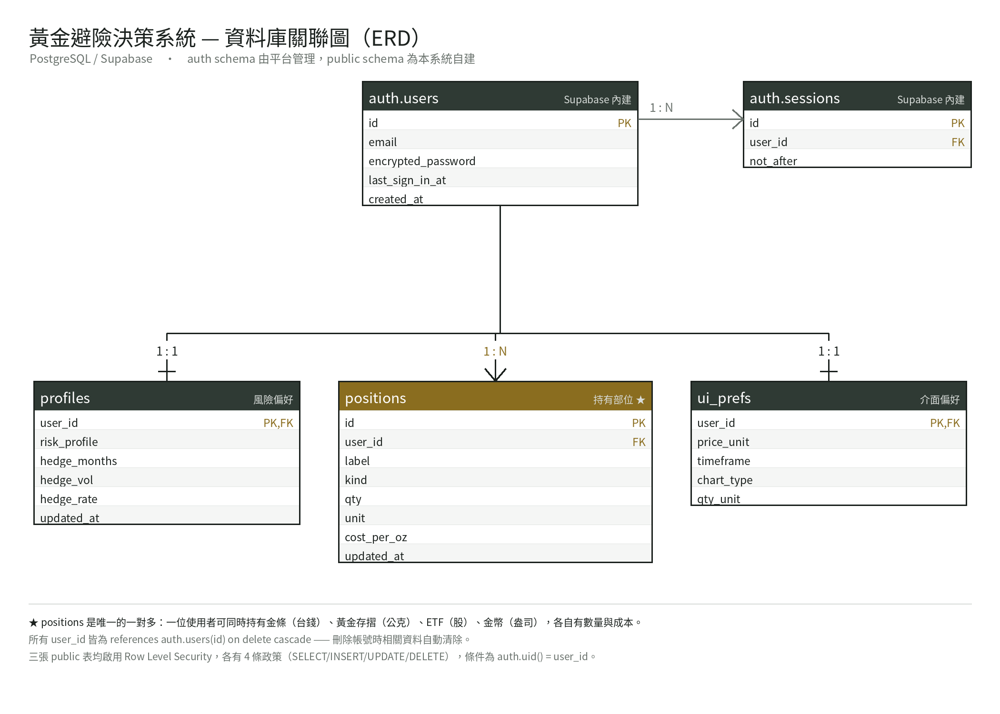
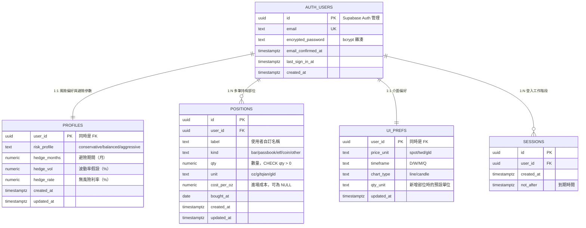

# 資料庫設計（ERD）

黃金避險決策系統 — Supabase / PostgreSQL

---

## 完整系統 ERD



> 上圖為圖片檔（可右鍵另存），下方為 Mermaid 原始碼版本（GitHub 會自動渲染）。
> 圖片由 `make_erd.py` 產生，改動結構後重跑該程式即可更新。




> `AUTH_USERS` 與 `SESSIONS` 屬於 Supabase 內建的 `auth` schema，由平台管理，
> 我們只讀不寫（登入 API 會自動維護）。`PROFILES` / `POSITIONS` / `UI_PREFS`
> 三張是本系統在 `public` schema 自建的表。

---

## 為什麼這樣切

| 表 | 關係 | 理由 |
|---|---|---|
| `profiles` | 1:1 | 一位使用者只有一種風險偏好與一組避險假設 |
| `positions` | **1:N** | 使用者常同時持有金條（台錢）、存摺（公克）、ETF（股），各自有數量與成本，必須是獨立的列 |
| `ui_prefs` | 1:1 | 介面偏好與投資資料的生命週期不同，分開存可獨立更新，不會因為改個圖表類型就重寫部位資料 |

### 1:N 才是關鍵

`positions` 是整個設計的核心。若把所有部位塞成一個 JSON 欄位：

- 無法查詢「所有成本高於現價的部位」——這在 SQL 只要一句
- 無法用 `CHECK` 約束擋掉髒資料（數量為負、單位打錯）
- 新增一筆部位得把整包重寫，並發修改會互相覆蓋

```sql
-- 正規化之後才寫得出來的查詢
select label, qty, unit, cost_per_oz
from positions
where user_id = auth.uid() and cost_per_oz > 4400
order by cost_per_oz desc;
```

---

## 完整性與安全性約束

**參照完整性**：三張表的 `user_id` 都是 `references auth.users(id) on delete cascade`
→ 使用者刪除帳號時，所有相關資料自動清除。

**值域約束**：`kind`、`unit`、`risk_profile` 等欄位都有 `CHECK`，
資料庫層就擋掉不合法的值，不倚賴前端驗證。

**Row Level Security**：每張表 4 條政策（SELECT / INSERT / UPDATE / DELETE），
條件都是 `auth.uid() = user_id`。

```sql
create policy "own_select" on public.positions
  for select using (auth.uid() = user_id);
```

`UPDATE` 政策同時寫 `using` 與 `with check`——少了後者，
使用者可以把自己那列的 `user_id` 改成別人的，等於竄改他人資料。

實測驗證（用網站上公開的 publishable key）：

| 測試 | 結果 |
|---|---|
| 未登入讀取 | `[]` 空陣列 |
| 未登入偽造 user_id 寫入 | `401` + `violates row-level security policy` |
| 列出使用者清單 | `401 no_authorization` |

---

## 版本演進

| 版本 | 結構 | 問題 |
|---|---|---|
| v1 | `user_prefs(user_id, prefs jsonb)` 單表 | 所有設定塞在一個 JSON 欄位，沒用到關聯式資料庫的價值 |
| **v2** | `profiles` / `positions` / `ui_prefs` 三表 | 正規化，支援多筆部位，可下條件查詢與約束 |

`supabase_migration_v2.sql` 內含自動搬遷，v1 的資料不會遺失。
